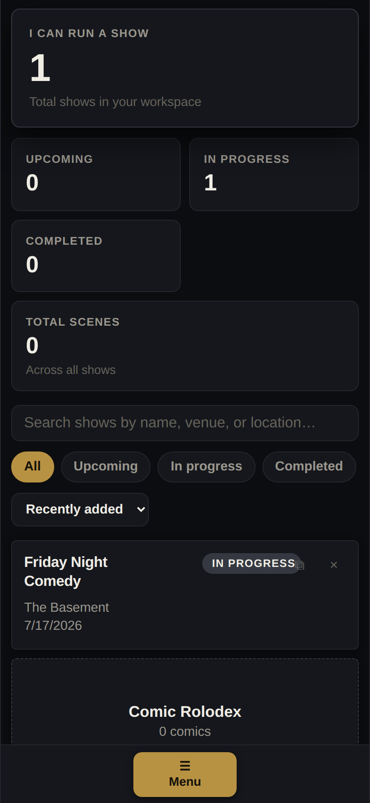
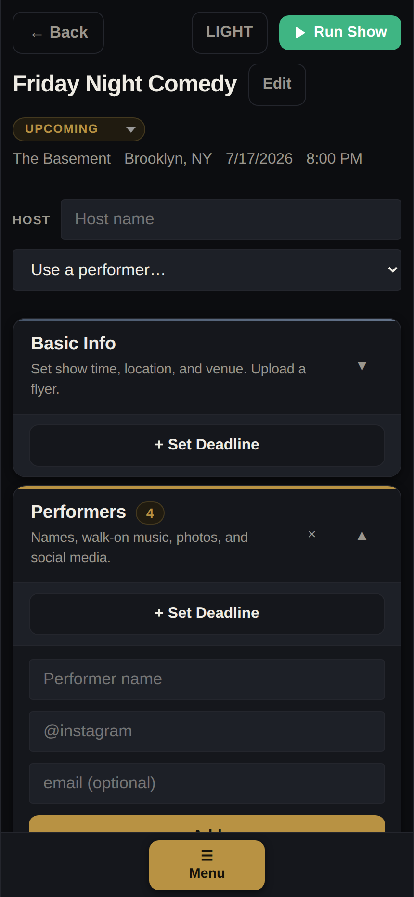
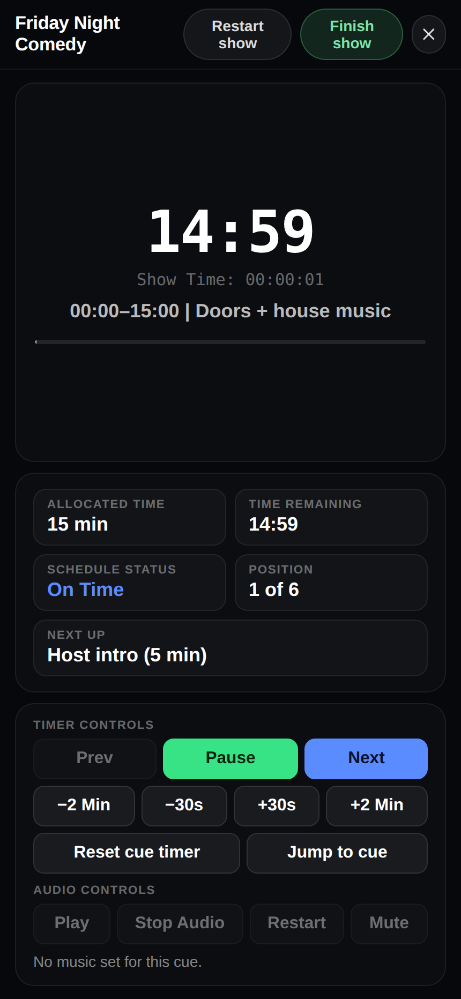

<div align="center">

# 🎤 Showrunner

**Show-management software for live-event coordinators — build the lineup, import the schedule, and run the show in real time.**

[**Live Demo →**](https://showrunner-theta.vercel.app)

[](https://github.com/taylordrew4u2/showrunner/actions/workflows/ci.yml)
[](LICENSE)
&nbsp;


</div>

> One tool for the full live-show lifecycle: plan the lineup, attach walk-on music, import a printed schedule by photo, then operate the show in a full-screen live mode with per-cue countdowns — and broadcast the on-stage state to a public viewer link.

## Table of Contents

- [Overview](#overview)
- [Problem](#problem)
- [Solution](#solution)
- [Features](#features)
- [Tech Stack](#tech-stack)
- [Architecture](#architecture)
- [How to Run Locally](#how-to-run-locally)
- [Usage](#usage)
- [What I Built](#what-i-built)
- [Technical Decisions](#technical-decisions)
- [Challenges Solved](#challenges-solved)
- [Testing](#testing)
- [Security](#security)
- [Accessibility](#accessibility)
- [Known Limitations](#known-limitations)
- [Roadmap](#roadmap)
- [License](#license)

---

## Screenshots

_Add product screenshots to `docs/screenshots/` — see [docs/screenshots/CAPTURE.md](docs/screenshots/CAPTURE.md), then uncomment the block below._

<!--
<p align="center">
  <br/>
  <br/>
  
</p>
-->

---

## Overview

Showrunner is a production tool for comedians, promoters, and stage managers who run recurring live shows. It covers the full show lifecycle: building a lineup, coordinating staff, importing a schedule from a PDF or photo, and operating the show in a full-screen live mode with cue timing and walk-on music.

The target user is an independent promoter or stage manager who currently uses a mix of spreadsheets, notes apps, and Spotify. Showrunner puts all of that in one place and syncs it across devices.

---

## Problem

Live show coordinators have no dedicated tool that spans pre-show planning and real-time stage management. Building a lineup, attaching walk-on music to performers, importing a printed schedule, and actually running the show are all separate workflows — usually spread across Google Docs, spreadsheets, and whatever music player is open. Nothing connects them.

---

## Solution

Showrunner handles the full workflow in a single application:

- **Before the show:** build the lineup, attach walk-on music and profile data to each performer, track the budget, coordinate staff and hosts, and export a PDF runsheet
- **Day of:** upload a photo, PDF, or plain text to import the schedule automatically via AI (with OCR + regex fallback)
- **During the show:** run a full-screen live mode with per-cue countdowns, manual walk-on music with automatic fade in/out, and live status broadcast to a public viewer URL
- **Audience-facing:** a separate public sign-up link for tattoo artist queueing, with email notification when an artist is up

---

## Features

**Show building**
- Multiple shows with status tracking (upcoming, in-progress, completed, cancelled)
- Per-show lineup with performer profiles: photo, social media, credits, walk-on track, audio file, and video
- Global performer rolodex — save a performer once, reuse across shows; edits sync to all matching performers
- Vendors, staff, host, expenses, and per-section deadlines on each show

**Schedule import**
- AI schedule import via GPT-4o-mini Vision (images), PDF.js (PDFs), and a regex fallback for plain text — all in the browser
- OCR fallback (Tesseract.js) when no OpenAI key is configured

**Run show**
- Full-screen live mode with per-cue countdown, 5-second pre-roll, drift indicator, and keyboard navigation
- Manual music start/stop per cue; fade in/out is automatic via Web Audio
- Public read-only viewer URL with live on-stage / up-next state
- One-tap restart and per-cue duration adjustment

**Artist sign-up (for tattoo / merch / etc. shows)**
- Public sign-up link with hero card (live status or "starts at" countdown) + flash sheet + uploaded schedule image
- Queue position shown on submit; sign-up list updates live
- Admin panel with Queue / Sign-ups / Settings tabs, including a one-tap "Email 'you're up'" button (sends via Brevo from a dedicated address — no SMS from your personal number)

**Platform**
- PWA (installable, offline shell)
- Client-side AES encryption with PBKDF2-derived keys — the server/DB only ever store ciphertext, and the database is reached through server API routes (the DB credential never ships to the browser)
- PDF runsheet export
- Drag-and-drop file uploads with MIME validation

---

## Tech Stack

- **Frontend:** React 19, TypeScript (strict mode)
- **Build:** Vite 7, vite-plugin-pwa (Workbox)
- **Database:** Turso (libSQL — serverless SQLite at the edge), accessed **server-side** via `@libsql/client`
- **Server API:** Vercel serverless functions (Node) under `/api` — all DB reads/writes go through these, so no DB credential is exposed to the browser
- **Encryption:** crypto-js (PBKDF2 key derivation, AES)
- **AI:** OpenAI GPT-4o-mini (vision + text); Tesseract.js fallback
- **PDF:** PDF.js (pdfjs-dist) — client-side extraction
- **Email:** Brevo REST API via a Vercel Edge function (`/api/notify-artist`)
- **Styling:** Custom CSS with a design-token system — no CSS framework
- **Hosting:** Vercel (web + serverless functions)
- **Auth:** Username/password — password-derived key encrypts stored data; no OAuth

---

## Architecture

```
showrunner/
├── api/
│   └── notify-artist.ts         # Vercel Edge function — sends "you're up" emails via Brevo
├── src/
│   ├── App.tsx                  # Root — auth, routing, global state
│   ├── App.css                  # Design tokens + layout system
│   ├── types/index.ts           # All shared TypeScript types
│   ├── components/
│   │   ├── Login.tsx
│   │   ├── ShowCard.tsx
│   │   ├── ShowDetail.tsx       # Per-show management hub
│   │   ├── RunShow.tsx          # Full-screen live mode
│   │   ├── LiveViewer.tsx       # Public read-only viewer (?view=…)
│   │   ├── ArtistSignup.tsx     # Public artist sign-up page (?artist=…)
│   │   ├── ArtistAdmin.tsx      # Admin queue + settings page
│   │   ├── Settings.tsx
│   │   ├── Expenses.tsx
│   │   └── sections/            # Per-section components inside ShowDetail
│   └── utils/
│       ├── secure-storage.ts    # Client-side encryption + calls to the API
│       ├── encryption.ts        # Key derivation and AES helpers (browser)
│       ├── api.ts               # fetch wrapper for the server API
│       ├── aiExtractor.ts       # OpenAI + PDF.js + OCR + regex pipeline
│       ├── audioEngine.ts       # Web Audio wrapper with fade + preload
│       ├── pdfExport.ts         # Client-side PDF generation
│       ├── liveView.ts          # Live state pub/sub (via the API)
│       └── artistSignup.ts      # Public sign-up data layer (via the API)
├── api/
│   ├── _lib/                    # libSQL client, schema bootstrap, auth, http (server-only)
│   ├── auth.ts                  # signup / login
│   ├── shows.ts                 # encrypted show blobs (load / save)
│   ├── settings.ts             # encrypted settings blob
│   ├── live.ts                  # live-viewer state
│   ├── artist.ts / artist-entries.ts  # public sign-up payload + queue
│   └── notify-artist.ts         # "you're up" emails via Brevo
└── .github/workflows/ci.yml     # Lint + tests + type-check + build on push/PR
```

**App flow:**

User signs in → the browser derives the encryption key + a password hash via PBKDF2 (neither the raw password nor the key ever leaves the device) → it calls the `/api` routes (sending a derived user id + hash) which read the encrypted blobs from Turso → the browser decrypts them → edits are encrypted client-side and written back through the API on a debounced interval → in live mode, schedule cues drive a public read-only viewer URL and the per-cue music timing.

---

## How to Run Locally

```bash
git clone https://github.com/taylordrew4u2/showrunner.git
cd showrunner
npm install
cp .env.example .env.local   # fill in the values
npm run dev
```

Production build:

```bash
npm run build
```

### Environment Variables

See `.env.example` for the full list. Required (server-side — **no** `VITE_` prefix, so they never reach the browser bundle):

```env
TURSO_DATABASE_URL=
TURSO_AUTH_TOKEN=
```

Optional:

```env
VITE_OPENAI_API_KEY=          # AI schedule import; falls back to OCR + regex without it

# Server-side, for /api/notify-artist
BREVO_API_KEY=
BREVO_SENDER_EMAIL=
BREVO_SENDER_NAME=Showrunner
```

The Turso variables are required for data persistence; the app surfaces a clear error if they are missing.

#### Artist notification emails (free)

The "Email 'you're up'" button in Artist admin sends a real email via [Brevo](https://www.brevo.com) — free tier allows 300 emails/day with no domain verification required.

One-time setup:

1. Sign up at brevo.com → verify your email
2. Settings → Senders & IP → add a sender email and click the verification link
3. Settings → SMTP & API → generate a v3 API key
4. Add `BREVO_API_KEY`, `BREVO_SENDER_EMAIL`, and `BREVO_SENDER_NAME` to your Vercel project env vars
5. Redeploy

Without these, the Email button shows a clear inline error explaining what's missing.

---

## Usage

1. Open the app and create an account (username + password)
2. Create a show and fill in basic info (name, date, venue)
3. Add performers to the lineup; upload walk-on music, photo, and profile data per performer
4. In the Schedule section, import a schedule by uploading a PDF, image, or pasting text — or build it cue-by-cue
5. (Optional) Generate the public viewer link and the artist sign-up link from the show detail page
6. On show day, open Run Show — cues advance with countdown timers, music plays with fades, and the live state is broadcast to anyone with the viewer link

---

## What I Built

- Designed and built the application from scratch, solo
- Implemented the responsive layout — 3-column desktop with CSS Grid `grid-template-areas`, collapsing to mobile below 1024px — no layout library
- Built the encryption layer: password-derived AES keys via PBKDF2, all data encrypted before reaching Turso; per-show write is debounced 1s
- Built the AI schedule import pipeline: GPT-4o-mini Vision for photos, PDF.js for multi-page PDFs, Tesseract.js OCR + regex fallback for plain text — runs fully in the browser
- Built the Web Audio engine wrapper for cue music — single AudioContext unlocked on Start, fade-in / fade-out on every cue change, buffer preloading for the current and next cue, and context-resume retry to survive iOS Safari auto-suspension
- Built the public read-only viewer URL and the artist sign-up flow (public sign-up form, admin queue with Mark-paid + Email button, Brevo edge function for notifications)
- Built the performer rolodex with cross-show sync — editing a rolodex entry propagates to all matching performers
- Set up the CI workflow (lint + type-check on every push/PR) and deployed to Vercel

---

## Technical Decisions

**No CSS framework.** Every component is styled with hand-written CSS using a design token system. This keeps the bundle small and gives full control over every interaction state and animation.

**Encryption in the client, not the server.** The server (Turso) stores only ciphertext. The password-derived key never leaves the device. This avoids the need to trust the database host with user data. The trade-off is that there is no password recovery — by design.

**AI pipeline with fallback.** Schedule import works without an API key by falling back to OCR + regex matching for common time formats. This makes the feature usable in environments where the OpenAI key is not configured or hits a rate limit.

**Web Audio API for cue music.** HTMLAudioElement was unreliable across iOS Safari's autoplay rules after auto-advance / pre-roll. The Web Audio path unlocks a single AudioContext on the Start tap, preloads buffers, and explicitly resumes the context on every play — this is the only path that works reliably in the field.

**Email instead of SMS for artist notifications.** SMS from the admin's phone exposes their personal number; commercial SMS APIs are not free at any meaningful volume. The app uses email via Brevo's free tier (300/day, no domain verification needed), with a "check your spam folder" hint on the sign-up form and confirmation screen.

**Debounced auto-save.** Changes to shows are saved to Turso after a 1-second debounce rather than on every keystroke. This avoids hammering the database while keeping data loss risk low. Each per-row form keeps an internal draft state so typing in one row doesn't re-render or re-save the rest of the lineup.

**Rolodex as source of truth.** Rather than duplicating performer data at show-creation time and letting it drift, editing a rolodex entry propagates updated fields to all matching performers in all shows.

---

## Challenges Solved

**Cue music that must not fail on a live stage.**
Music had to start crisply at every cue, including after auto-advance, on iOS Safari, after a 5-second silent pre-roll. The fix combined: a single AudioContext unlocked on the Start gesture; buffer preloading of the current and next cue's audio so `decodeAudioData` doesn't add latency; an explicit `ctx.resume()` before and after the (async) decode in `play()`; and a single retry 120ms later if the first play fails. After field testing where even this proved imperfect under unpredictable network conditions, the operator can now manually trigger Play / Stop per cue with fades still automatic.

**Preventing data loss on save failure.**
If the Turso write fails during auto-save, the in-memory state must not be overwritten by a subsequent load. Solution: a `dataLoaded` ref is set after the initial load succeeds; the auto-save effect checks this ref before writing, so a failed load doesn't trigger a save that would wipe the database row.

**Per-row form edits without lagging the whole schedule.**
The schedule editor lived in a single component and re-rendered every cue row on every keystroke in any cue's edit input, plus the music-duration field propagated each keystroke up to the App root. The fix extracted `CueRow` as `React.memo`'d with its own draft state and stable parent callbacks via refs — non-editing rows now skip re-render entirely.

**Routing serverless functions alongside an SPA.**
The original `vercel.json` rewrite used a negative-lookahead pattern that didn't actually exclude `/api/*` in practice — Vercel served `index.html` for the function path. Switched to an explicit two-rule form so the function gets the request.

---

## Testing

Unit tests (Vitest) cover the pure logic: schedule text parsing, cue timing/formatting, performer cover-sync, encryption round-trip, and ID generation. Run them with `npm test`. CI (GitHub Actions) runs lint + type-check + build + tests on every push and PR. Component/E2E tests are not yet implemented; manual verification covers the UI flows.

---

## Security

- Passwords are never stored; a PBKDF2-derived key is used for encryption and a separate hash is stored for authentication
- All show data and settings are encrypted with AES (crypto-js) before being written to Turso
- All API keys and database credentials are loaded from environment variables — no fallback values in source
- The database is reached only through server-side API routes; the Turso credential is a server env var and is never included in the client bundle
- The static salt used in key derivation is a known limitation — per-user random salts would improve security
- No rate limiting on authentication

---

## Accessibility

Accessibility has not been formally reviewed. Basic considerations present:

- Form inputs have associated labels
- Interactive elements have minimum 44px touch targets
- Semantic HTML elements throughout

A keyboard-navigation + ARIA audit is a future improvement.

---

## Known Limitations

- PBKDF2 uses a static salt and 1000 iterations — adequate for a personal project but below current production recommendations
- Unit tests cover the core pure logic; no component or end-to-end tests yet
- No password recovery — losing the password means losing access to all data
- AI schedule import depends on an OpenAI key; without it, only the OCR + regex fallback runs
- Error handling is present but not exhaustive — some failure states surface as console errors rather than user-facing messages

---

## Roadmap

- Add per-user random salts and bump PBKDF2 iterations
- Add component + end-to-end tests (unit tests are in place)
- Accessibility audit (keyboard nav, ARIA, color contrast)
- Add product screenshots to the README (scaffold in `docs/screenshots/`)

---

## License

MIT — see [LICENSE](LICENSE).

---

## Status

Active and deployed in production. Built and refined alongside real live shows.
