<div align="center">


# I Can Run A Show

**Book the lineup, collect signed contracts, and run the live show from one phone, with everything encrypted before it leaves the device.**


-111827)
[](https://github.com/taylordrew4u2/Showrunner-ICanRunAShow/actions/workflows/ci.yml)
[](LICENSE)

[**Live app**](https://icanrunashow.com) · [**Product tour**](https://icanrunashow.com/tour/) · [**Docs**](docs/ARCHITECTURE.md)

<br />

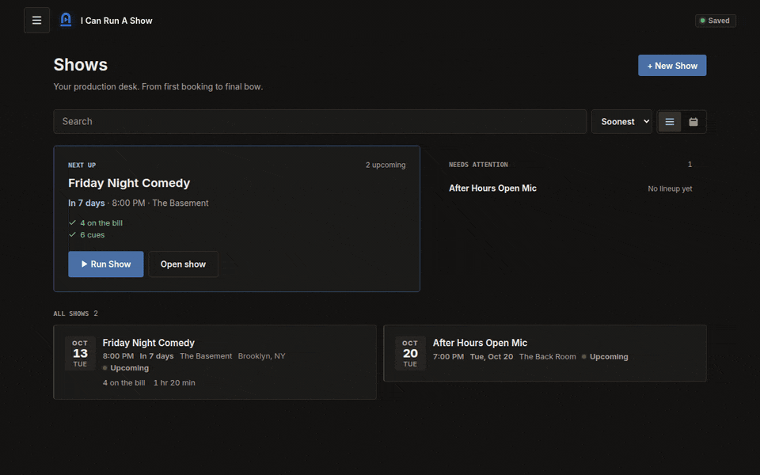

<sub>Dashboard → show page → Run Show: the clock counts down, cues advance, and walk-on music plays from each performer's button.</sub>

</div>

## Why I built it

Producers of recurring comedy, drag and variety nights tend to run them from a spreadsheet, a notes app, a group chat and whatever music player is open. Each of those breaks at the worst moment: in a venue basement with no signal, while a performer is walking on. This app puts booking, paperwork and the live run of the night in one tool that works offline and is built for a phone.

## Highlights

- **The server never sees a producer's data in the clear.** Shows, settings and media are encrypted in the browser with a PBKDF2-SHA256 key (100,000 iterations) before they reach the API; Turso stores encrypted blobs, and the DB credential lives only in server env vars.
- **Shareable links the server still can't read.** A contract-signing link re-encrypts the document under a one-off key carried in the URL fragment (`#k=…`), which browsers never send; the viewer page's walk-on audio works the same way. An E2E test asserts no request carries the key.
- **Exactly-once signatures, enforced in SQL.** `UPDATE … WHERE token = ? AND signed_at IS NULL` makes a replayed or racing submit harmless, and each signature records a SHA-256 of the exact document shown.
- **No lost saves across tabs.** Every write carries the SHA-256 of the ciphertext it expects to replace; the API answers `409 save_conflict` on a mismatch, so a stale tab can't erase a newer edit. Saves are debounced at 1s and blocked until the initial load succeeds.
- **Media garbage collection by reachability.** Uploads are encrypted chunks referenced from shows, the music library, the Rolodex, contracts and the trash. The browser decides what's unreachable (the server can't read references), and the sweep is disabled until the account has fully loaded.
- **1,045 unit tests and 120 E2E tests.** 104 Vitest files, plus 23 Playwright specs each run as desktop and phone against a hermetic in-memory API, on every push and PR.

## Features

| Area | What it does |
| --- | --- |
| **Run Show** | Full-screen live mode: cue countdown with ahead/behind indicator, running order, and a soundboard with one button per performer (their face, their walk-on track, configurable fades). Screen wake lock and fullscreen for the length of the show. |
| **Stage remote** | Pair any Bluetooth clicker; the app learns its key so live mode can be driven from the stage. |
| **Lineup and Rolodex** | Performer profiles with headshot, socials, credits and walk-on music. Save once, and edits sync to every show they're on. |
| **Schedule import** | Photo, PDF or pasted text → running order, on the device: PDF.js, Tesseract OCR and a time-aware line parser. |
| **Contracts** | Send a PDF; performers read and sign from a link with no account. Track who has signed. |
| **Live viewer** | A public, read-only page showing who's on stage and who's next, updated live. |
| **Season report** | Shows, audience, net, regulars and top rooms for the year, plus a venue pitch composed from those numbers. |
| **Show admin** | Flyers, budget and expenses, staff and hosts, deadlines, PDF runsheet export, announcement captions, recurring shows. |

Full list: [docs/FEATURES.md](docs/FEATURES.md)

## Screenshots

<table>
  <tr>
    <td width="33%">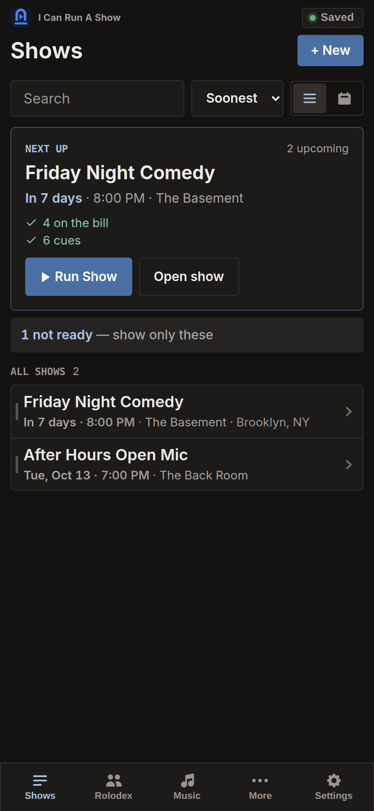</td>
    <td width="33%">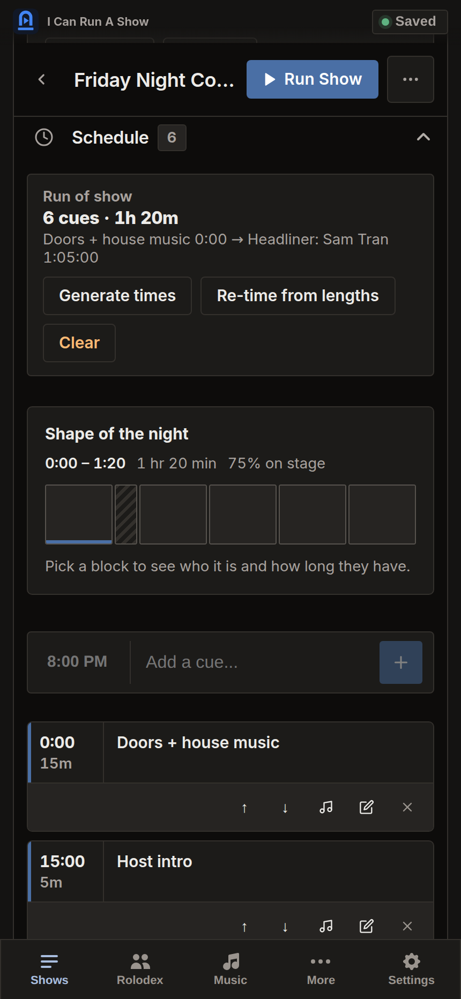</td>
    <td width="33%">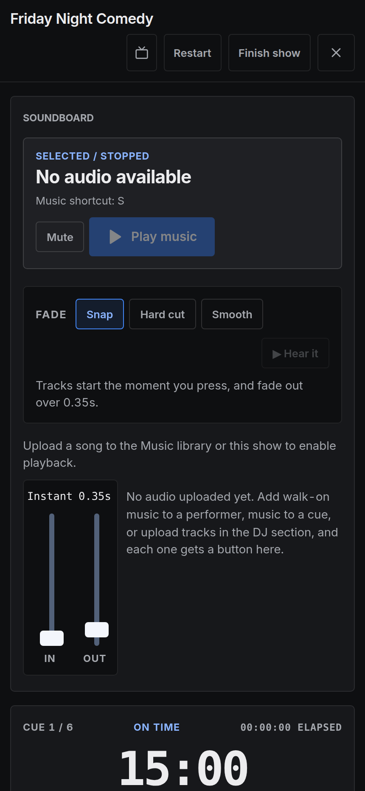</td>
  </tr>
  <tr>
    <td align="center"><sub><b>Dashboard</b>: the next show and its readiness</sub></td>
    <td align="center"><sub><b>Run of show</b>: timed cues and segment lengths</sub></td>
    <td align="center"><sub><b>Run Show</b>: soundboard and cue clock</sub></td>
  </tr>
  <tr>
    <td>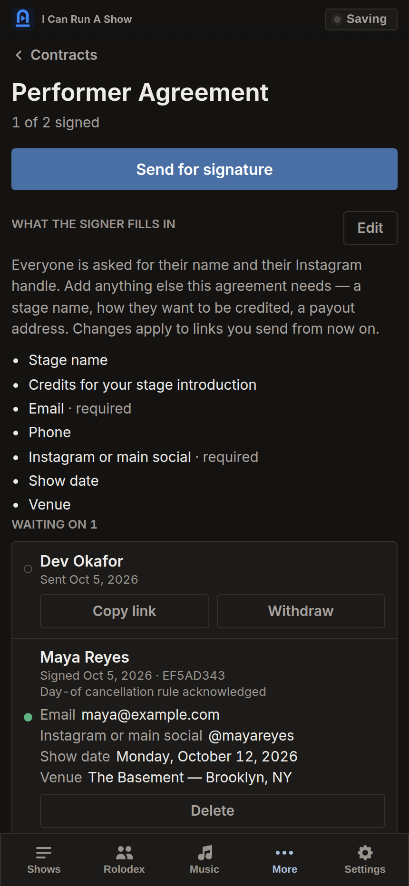</td>
    <td>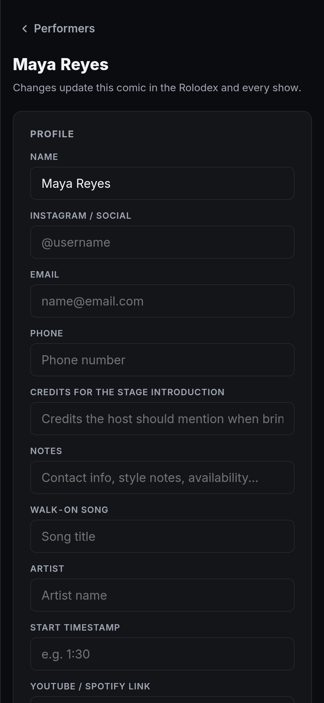</td>
    <td>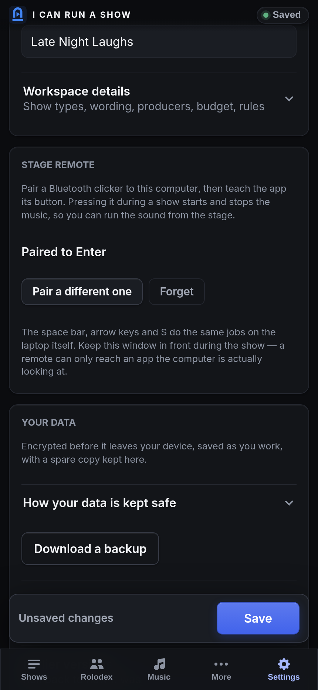</td>
  </tr>
  <tr>
    <td align="center"><sub><b>Contracts</b>: who has signed</sub></td>
    <td align="center"><sub><b>Performer profile</b></sub></td>
    <td align="center"><sub><b>Stage remote</b> and storage sweep</sub></td>
  </tr>
</table>

<details>
<summary>Desktop and more screens</summary>
<br />
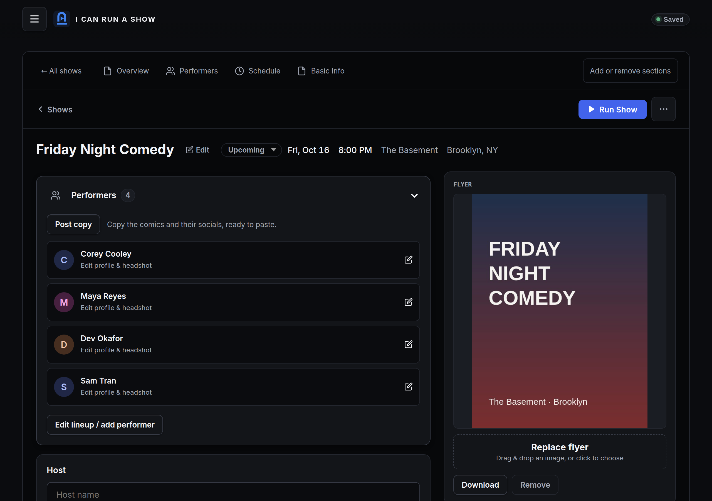
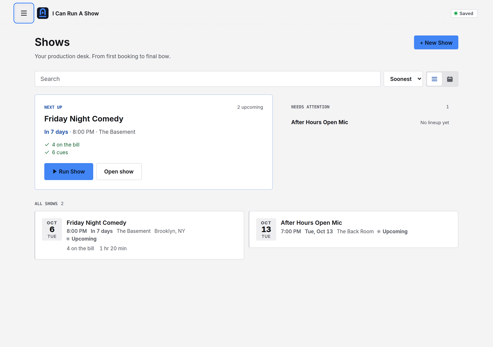
<table>
  <tr>
    <td width="33%">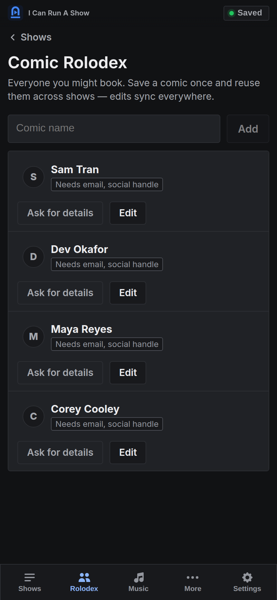</td>
    <td width="33%">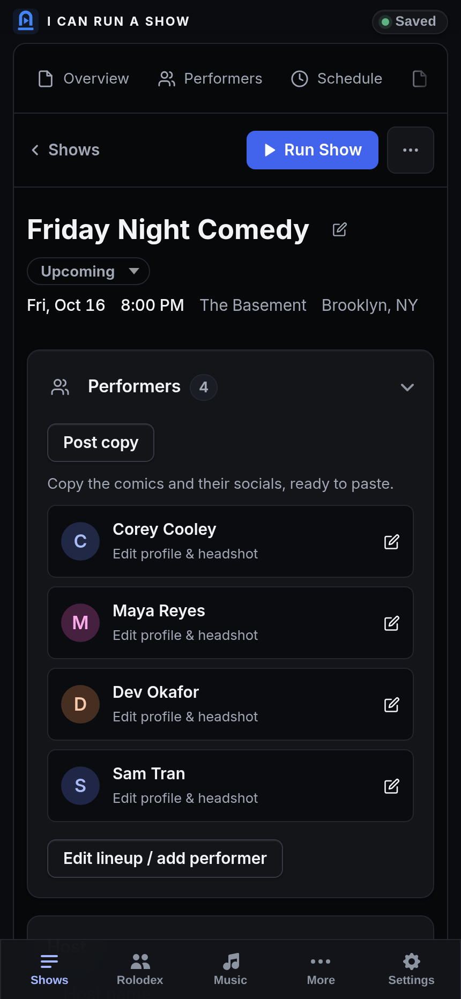</td>
    <td width="33%">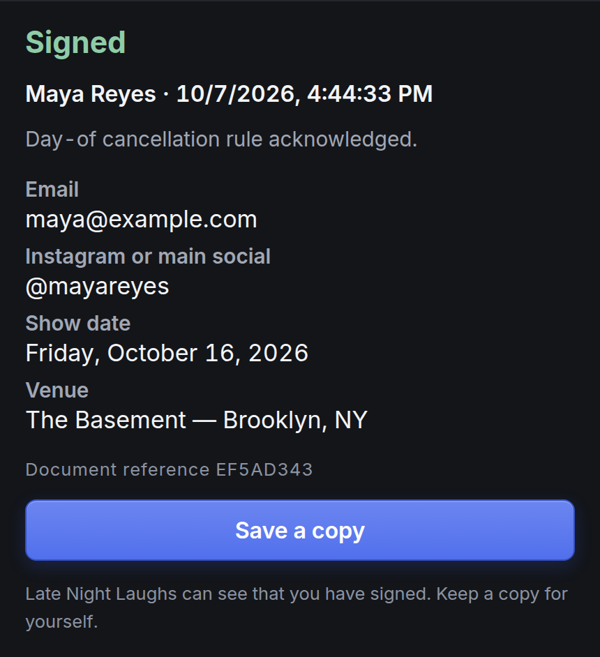</td>
  </tr>
  <tr>
    <td align="center"><sub>Rolodex</sub></td>
    <td align="center"><sub>Show detail</sub></td>
    <td align="center"><sub>Signer's receipt</sub></td>
  </tr>
</table>
</details>

Screenshots are generated from a production build with sample data by `npm run screenshots` ([how](docs/screenshots/CAPTURE.md)).

## Architecture

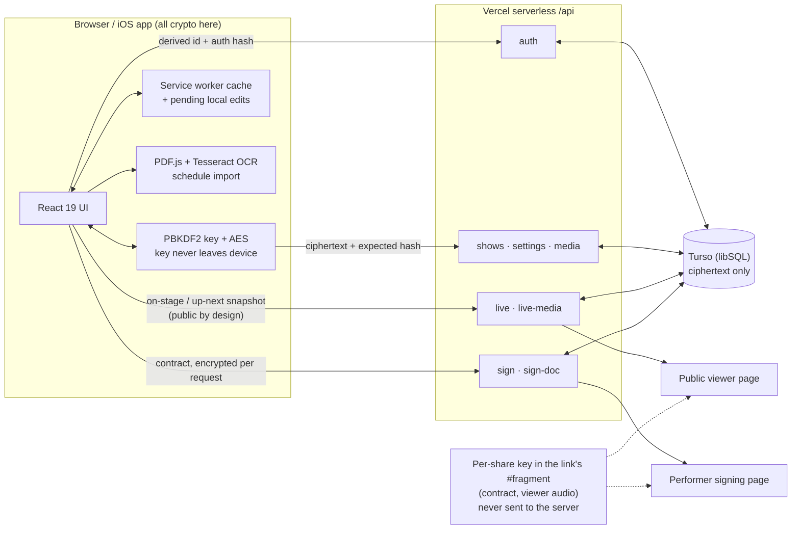
```mermaid
flowchart LR
    subgraph Browser["Browser / iOS app (all crypto here)"]
        UI["React 19 UI"]
        Crypto["PBKDF2 key + AES<br/>key never leaves device"]
        Local["Service worker cache<br/>+ pending local edits"]
        Import["PDF.js + Tesseract OCR<br/>schedule import"]
        UI <--> Crypto
        UI <--> Local
        UI --> Import
    end

    subgraph API["Vercel serverless /api"]
        Auth["auth"]
        Data["shows · settings · media"]
        Live["live · live-media"]
        Sign["sign · sign-doc"]
    end

    DB[("Turso (libSQL)<br/>ciphertext only")]
    Viewer["Public viewer page"]
    Signer["Performer signing page"]

    Crypto -- "ciphertext + expected hash" --> Data
    UI -- "derived id + auth hash" --> Auth
    UI -- "on-stage / up-next snapshot<br/>(public by design)" --> Live
    UI -- "contract, encrypted per request" --> Sign
    Auth & Data & Live & Sign <--> DB
    Live --> Viewer
    Sign --> Signer
    Key["Per-share key in the link's #fragment<br/>(contract, viewer audio)<br/>never sent to the server"]
    Key -.-> Viewer
    Key -.-> Signer
```

**Design decisions**

- **Encrypt on the client, accept no password recovery.** The database host is never trusted with user data. The cost is real and documented: lose the password, lose the data.
- **Keys in the URL fragment for sharing.** A performer with no account can open a signing link from a text message, and the server still can't decrypt the contract, because fragments are never sent in requests or `Referer`.
- **Schedule import stays on the device.** No upload, no per-use API bill, and it behaves the same on every install. The trade-off: OCR quality limits messy or handwritten sheets.
- **Web Audio instead of `<audio>`.** `HTMLAudioElement` was unreliable under iOS Safari's autoplay rules after auto-advance; one `AudioContext` unlocked on the first tap, with preloaded buffers and explicit `resume()`, is not.
- **Hand-written CSS on design tokens, no framework.** Type, spacing, z-index and motion scales as CSS variables; light/dark is a single `data-theme` swap. The Inter variable font is self-hosted so it's precached for offline use.

More, including the bugs that shaped these: [docs/ARCHITECTURE.md](docs/ARCHITECTURE.md) · [docs/SECURITY.md](docs/SECURITY.md)

## Tech stack

| Layer | Choice |
| --- | --- |
| Frontend | React 19, TypeScript 5.9 (strict), hand-written CSS on design tokens |
| Build / PWA | Vite 8, vite-plugin-pwa (Workbox), self-hosted Inter |
| API | Vercel serverless functions (Node, TypeScript) in `api/` |
| Database | Turso (libSQL) via `@libsql/client`, server-side only |
| Crypto | crypto-js: PBKDF2-SHA256 key derivation, AES, SHA-256 |
| Documents | PDF.js 5, Tesseract.js 7, client-side PDF export |
| Native | Capacitor 8 iOS wrapper |
| Testing / CI | Vitest 4, Playwright, ESLint, GitHub Actions |

## Getting started

Requires Node 20+ and a [Turso](https://turso.tech) database.

```bash
git clone https://github.com/taylordrew4u2/Showrunner-ICanRunAShow.git
cd Showrunner-ICanRunAShow
npm install
cp .env.example .env.local   # set TURSO_DATABASE_URL and TURSO_AUTH_TOKEN
npm run dev
```

The Turso variables have no `VITE_` prefix, so they never reach the browser bundle. For the iOS app (macOS + Xcode): `npm run ios:sync`, then `npm run ios:open` ([docs/IOS.md](docs/IOS.md)).

### Subscriptions (Stripe)

The Producer plan is billed through Stripe Checkout and the Stripe customer portal. Card details only ever touch Stripe's hosted pages; the app stores the subscription status the webhook reports, keyed by the account's opaque id (usernames never go to Stripe). Without the keys below, the app runs exactly as before and the Plan card in Settings says paid plans aren't open.

1. In Stripe, create a product **Producer** with a recurring **$9/month** price, and copy the price ID.
2. Add a webhook endpoint at `https://<your domain>/api/stripe-webhook` for `checkout.session.completed`, `customer.subscription.created`, `customer.subscription.updated` and `customer.subscription.deleted`, and copy its signing secret.
3. Turn on the customer portal (Stripe → Settings → Billing → Customer portal) so subscribers can change their card or cancel.
4. In Vercel, set `STRIPE_SECRET_KEY`, `STRIPE_PRICE_ID`, `STRIPE_WEBHOOK_SECRET` and `APP_URL`, then redeploy. Use test-mode keys first; card `4242 4242 4242 4242` completes a test checkout.

Producer unlocks sending contracts for signature, reading a schedule off a photo or PDF, making a live audience link, the Season report, and pairing a stage remote. On the free plan each of these shows what it is and an Upgrade button in place of the control. Locks only apply once the server has Stripe keys and has confirmed the account is on the free plan; if the plan can't be checked (offline, say), nothing is locked. A lapsed plan never breaks a show in progress: links already shared, contracts already signed and a remote already paired keep working. Accounts created before the locks shipped (`SUBSCRIPTIONS_STARTED_AT` in `api/billing.ts`, 2026-10-06 23:31:58 UTC) are founding members: the server reports them as on the Producer plan, so nothing is ever locked for them and they are never sent to checkout. The switch is `PAID_FEATURES_LOCKED` in `src/utils/billing.ts`. The locks are in the app, not enforced by the API.

## Testing

```bash
npm test               # 1,045 Vitest unit tests across 104 files
npm run lint           # ESLint
npm run build          # env check + type-check (app and API) + production build
npm run e2e:install    # once: fetch Playwright's Chromium
npm run e2e            # 120 Playwright tests: 23 specs × desktop and phone
```

The E2E suite builds and serves the production bundle itself and runs against an in-memory API (`e2e/support/fake-api.mjs`) that reproduces the server rules that matter, including sign-once. It needs no database or secrets. CI runs lint, unit tests and build in one job and E2E in a second. Details: [docs/TESTING.md](docs/TESTING.md)

## Project structure

```
src/components/   Screens: ShowDetail, RunShow, LiveViewer, Contracts, SigningPage, SeasonReport, ...
src/utils/        Pure logic with a test beside each module (encryption, audio engine, import, media GC)
api/              Vercel serverless routes: auth, shows, settings, media, live, sign
e2e/              Playwright specs + in-memory API stand-in
ios/              Capacitor iOS project
docs/             Architecture, features, testing, security, iOS
```

---

<div align="center">

Built by Taylor Drew · [github.com/taylordrew4u2](https://github.com/taylordrew4u2)

Released under the [MIT License](LICENSE).

</div>
