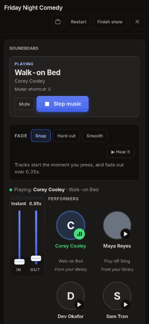
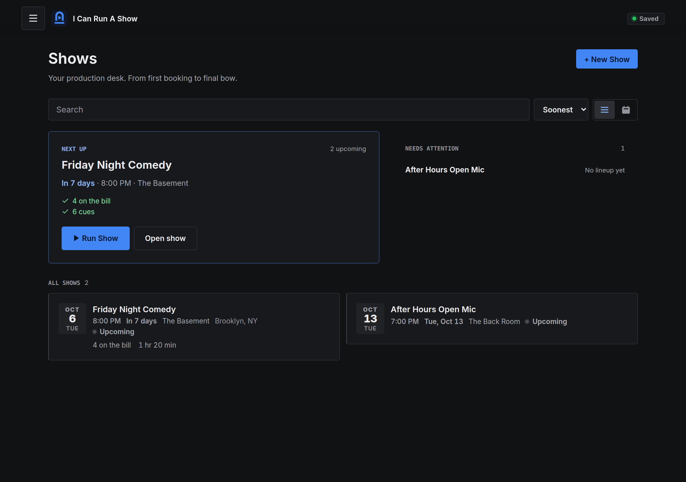

<div align="center">

<picture>
  <source media="(prefers-color-scheme: dark)" srcset="public/brand/logo-on-dark.svg" />
  
</picture>

**Live-show management for comedy, drag, and variety producers: build the lineup, import the schedule, and run the show from one app.**

[**Live app: icanrunashow.com**](https://icanrunashow.com)

[](https://github.com/taylordrew4u2/Showrunner-ICanRunAShow/actions/workflows/ci.yml)
[](LICENSE)


</div>

<p align="center">
  
</p>

## Overview

Independent producers who run recurring live shows usually juggle spreadsheets, a notes app, a group chat, and whatever music player is open. I Can Run A Show replaces that with one tool that covers the whole lifecycle: book performers, collect signed agreements, import a printed run sheet, and then operate the night itself in a full-screen live mode with walk-on music, cue timing, and a public "who's on stage" link.

It is built phone-first for venue basements with bad signal: an installable PWA with client-side encryption, deployed in production and used for real shows.

## Key features

- **Lineup and Rolodex.** Performer profiles with headshot, socials, credits and walk-on track; save a performer once and edits sync to every show they're on.
- **Run Show live mode.** A clock, a soundboard, and one button per performer with their face on it. Tap to fade their walk-on in, tap again to fade out. Per-cue countdown and drift indicator.
- **Stage remote.** Pair any Bluetooth clicker; the app learns its button so the operator can run sound from the stage. Fullscreen and screen wake lock for the length of the show.
- **Schedule import on the device.** Turn a photo, PDF, or pasted text into a running order using PDF.js, Tesseract OCR and a time-aware line parser. Nothing is uploaded.
- **Contracts without accounts.** Send a PDF to a performer; they read and sign from a link with no login. Each signature records the typed name, timestamp, and a SHA-256 of the exact document shown.
- **Public viewer link.** A read-only page that shows who's on stage and who's up next, updated live.
- **Show admin.** Flyers, budget and expenses, staff and hosts, deadlines, PDF runsheet export, and a ready-to-paste announcement caption.

Full list: [docs/FEATURES.md](docs/FEATURES.md)

## Tech stack

| Layer | Choice |
| --- | --- |
| Frontend | React 19, TypeScript (strict), hand-written CSS on a design-token system (no CSS framework) |
| Build / PWA | Vite 8, vite-plugin-pwa (Workbox), self-hosted variable Inter |
| API | Vercel serverless functions (Node) under `/api` |
| Database | Turso (libSQL) via `@libsql/client`, server-side only |
| Crypto | PBKDF2 key derivation + AES (crypto-js), all in the browser |
| Documents | PDF.js for extraction, Tesseract.js for OCR, client-side PDF export |
| Native | Capacitor iOS wrapper |
| Testing | Vitest, Playwright, GitHub Actions |

## Engineering highlights

- **Ciphertext-only storage.** Data is encrypted in the browser with a password-derived key before it reaches the API. The database holds only ciphertext, and the DB credential never ships to the client.
- **Sharing without leaking the key.** Signing and viewer links re-encrypt data under a per-share key carried in the URL fragment, which browsers never send to a server. The end-to-end suite asserts that no request carries the key.
- **Sign-once enforced in SQL.** `UPDATE ... WHERE signed_at IS NULL` makes each signature request single-use, so a replayed or racing submit is harmless.
- **Offline-first.** Precached app shell and fonts; edits are kept locally and saved when the signal returns. Saves are debounced, gated on a successful load, and protected against stale tabs overwriting newer data.
- **Safe media garbage collection.** Uploads are deleted by reachability (shows, library, Rolodex, contracts, trash) rather than ownership, so duplicated shows and restorable trash never lose files.
- **Reliable stage audio.** A Web Audio engine with buffer preloading, fades, and explicit context resume to survive iOS Safari's autoplay rules.
- **Tested on desktop and phone.** 1,000+ unit tests and 22 Playwright specs, each run in a desktop and a phone project, against a hermetic in-memory API. CI runs lint, tests, type-check, build, and E2E on every push and PR.

Design decisions and the bugs that shaped them: [docs/ARCHITECTURE.md](docs/ARCHITECTURE.md)

## Screenshots

<p align="center">
  
</p>
<p align="center"><sub><b>Run Show</b>: the cue countdown, the drift indicator, and the running order advancing</sub></p>

<p align="center">
  
  
  
</p>
<p align="center"><sub><b>Shows dashboard</b> · <b>Run-of-show builder</b> · <b>Contracts</b></sub></p>

<details>
<summary>More screenshots</summary>

<p align="center">
  
  
</p>
<p align="center">
  
  
  
</p>
<p align="center">
  
  
  
</p>

</details>

Screenshots are generated from a production build with sample data by `npm run screenshots` ([how](docs/screenshots/CAPTURE.md)).

## Getting started

Requires Node 20+ and a [Turso](https://turso.tech) database.

```bash
git clone https://github.com/taylordrew4u2/Showrunner-ICanRunAShow.git
cd Showrunner-ICanRunAShow
npm install
cp .env.example .env.local   # set TURSO_DATABASE_URL and TURSO_AUTH_TOKEN
npm run dev
```

The Turso variables are server-side only (no `VITE_` prefix), so they never reach the browser bundle.

For the iOS app (macOS + Xcode): `npm run ios:sync` then `npm run ios:open`. See [docs/IOS.md](docs/IOS.md).

## Testing

```bash
npm test               # unit tests (Vitest)
npx tsc -b             # type-check
npm run lint           # ESLint
npm run build          # production build
npx playwright test    # end-to-end, desktop + phone
```

The end-to-end suite builds and serves the app itself and runs against an in-memory API, so it needs no database or secrets. Run `npm run e2e:install` once to fetch the browser. Details and spec coverage: [docs/TESTING.md](docs/TESTING.md)

## Project structure

```
src/components/   Screens: ShowDetail, RunShow, LiveViewer, Contracts, SigningPage, Settings, ...
src/utils/        Pure logic (encryption, audio engine, import parser, media GC), tested module by module
api/              Vercel serverless routes: auth, shows, settings, media, live, sign
e2e/              Playwright specs + in-memory API stand-in
ios/              Capacitor iOS project
docs/             Architecture, features, testing, security, iOS
```

## Documentation

- [Features](docs/FEATURES.md): the complete feature list
- [Architecture](docs/ARCHITECTURE.md): structure, data flow, technical decisions, challenges solved
- [Testing](docs/TESTING.md): commands, E2E coverage, CI
- [Security, limitations and roadmap](docs/SECURITY.md)
- [iOS](docs/IOS.md): building and signing the native wrapper

## Author

Designed and built by [@taylordrew4u2](https://github.com/taylordrew4u2).

## License

MIT. See [LICENSE](LICENSE).
