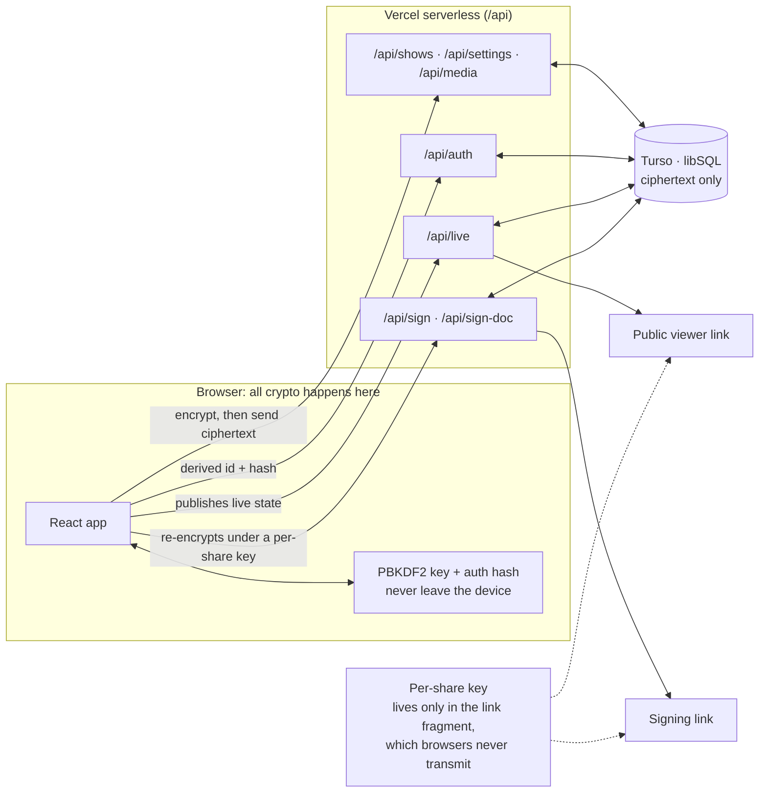

# Architecture

How the app is put together, the decisions behind it, and the problems that shaped it.

## Project structure

```
Showrunner-ICanRunAShow/
├── src/
│   ├── App.tsx                  # Root: auth, routing, global state, debounced save
│   ├── App.css · design.css · utility.css   # Design tokens, layout, utility skin
│   ├── fonts.css                # Self-hosted Inter (@font-face + unicode-range)
│   ├── types/                   # Shared TypeScript types
│   ├── components/              # Screens and UI (ShowDetail, RunShow, LiveViewer,
│   │                            #   Contracts, SigningPage, Settings, …)
│   └── utils/                   # Pure logic, each module with its own tests
│       ├── secure-storage.ts    # Client-side encryption + calls to the API
│       ├── encryption.ts        # Key derivation and AES helpers
│       ├── api.ts               # fetch wrapper for the server API
│       ├── aiExtractor.ts       # On-device PDF.js + OCR + line-parser pipeline
│       ├── audioEngine.ts       # Web Audio wrapper with fades + preload
│       ├── pdfExport.ts         # Client-side PDF generation
│       ├── liveView.ts          # Live state pub/sub (via the API)
│       ├── contracts.ts         # Per-request keys, signing links, doc hashing
│       ├── mediaCleanup.ts      # Which uploads are still reachable, and the sweep
│       ├── showBlocks.ts        # Which sections a new show starts with
│       ├── stageRemote.ts       # Learning a Bluetooth clicker's key
│       ├── theme.ts             # Color-scheme tokens + persistence
│       └── terminology.ts       # Show-type-aware Rolodex wording
├── api/                         # Vercel serverless functions (server-only)
│   ├── _lib/                    # libSQL client, auth, credentials, rate limit, http
│   ├── auth.ts                  # Sign-up / login (salted slow hash, rate-limited)
│   ├── shows.ts · settings.ts   # Encrypted show and settings blobs
│   ├── live.ts · live-media.ts  # Live-viewer state and media
│   ├── media.ts                 # Chunked encrypted uploads (+ inventory for the sweep)
│   ├── sign.ts                  # Signature requests; sign-once enforced in SQL
│   └── sign-doc.ts              # The contract itself, ciphertext under a per-request key
├── e2e/                         # Playwright specs, desktop + phone
│   └── support/fake-api.mjs     # In-memory stand-in for the API, incl. the sign-once rule
├── ios/                         # Capacitor iOS project
├── public/fonts/                # Inter variable subsets, precached by the service worker
└── .github/workflows/ci.yml     # Lint, unit tests, type-check + build; then E2E
```

## Data flow

The user signs in, and the browser derives an encryption key and a separate auth hash via PBKDF2. Neither the raw password nor the key leaves the device. The browser calls the `/api` routes with a derived user id and hash; the routes read encrypted blobs from Turso; the browser decrypts them. Edits are encrypted client-side and written back through the API on a 1-second debounce. In live mode, schedule cues drive a public read-only viewer URL and per-cue music timing.



## Technical decisions

**No CSS framework.** Every component is styled with hand-written CSS on a design-token system: type scale (`--text-*`), spacing (`--space-*`), z-index layers (`--z-*`), timing (`--duration-*`, `--ease-*`) and a radius scale. The utility look is layered last in `src/utility.css`, so it restyles by token rather than by rewriting every component sheet. Light/Dark is a `data-theme` swap, applied app-wide and on the public viewer link.

**Phone-first, with a phone layout on a phone.** One set of components serves every width; the shape changes rather than the code. A show is a card where two fit side by side, and a row in an inset grouped list on a phone. At 900px the bottom navigation becomes a sidebar.

**The typeface ships with the app.** Inter used to load from Google Fonts. The service worker only precaches same-origin assets, so offline, or on a venue connection, the typography fell back to a system face. It is now served from this origin and precached (latin and latin-ext; other subsets load on demand via `unicode-range`), as the variable axis rather than static cuts. The codebase uses `font-weight: 650`, which static cuts had been silently rounding to 700.

**Encryption in the client, not the server.** Turso stores only ciphertext and the password-derived key never leaves the device, so the database host is never trusted with user data. The trade-off is deliberate: there is no password recovery.

**Letting a stranger read what the server cannot.** A signing link has to work for someone with no account, on a phone, from a text message, while the server stays unable to read a producer's data. The browser re-encrypts under a key generated for that one share, and the key travels in the URL fragment, which browsers never send in a request line or `Referer`. `/api/sign` and `/api/sign-doc` store ciphertext addressed by an unguessable token, plus one plaintext column, `signed_at`, because `UPDATE … WHERE signed_at IS NULL` is what makes a request signable exactly once and a replayed or racing POST harmless.

**Deleting an upload is a reachability question.** Uploads live as encrypted chunks. A naive delete loses data, because references are shared: duplicating a show copies the same media ids, a library track appears in every show's DJ list, and a show in the trash is still restorable. The collector subtracts everything still reachable (shows, library, Rolodex, contracts, trash) and deletes only the remainder. The server can list what it stores but cannot know what is in use, so it hands over the inventory and the browser decides. The sweep is gated on the account having actually loaded, since a client that failed to load would judge every file unused.

**Schedule import runs on the device.** PDF.js, on-device OCR and a line parser for common time formats. Nothing leaves the phone, nothing can bill anyone, and the feature works the same on every install.

**Web Audio API for cue music.** `HTMLAudioElement` was unreliable under iOS Safari's autoplay rules after auto-advance. The Web Audio path unlocks a single `AudioContext` on the Start tap, preloads buffers, and explicitly resumes the context on every play.

**Debounced auto-save.** Show changes are saved after a 1-second debounce rather than per keystroke. Per-row forms keep their own draft state so typing in one row doesn't re-render or re-save the rest of the lineup.

**Rolodex as source of truth.** Editing a Rolodex entry propagates the updated fields to all matching performers in all shows, rather than letting copies drift.

## Challenges solved

**Cue music that must not fail on a live stage.** Music had to start crisply at every cue, including after auto-advance on iOS Safari. The fix combined a single `AudioContext` unlocked on the Start gesture, preloading the current and next cue's buffers so `decodeAudioData` adds no latency, an explicit `ctx.resume()` around the async decode, and one retry 120ms later if the first play fails. After field testing, the operator also got manual Play/Stop per cue, with fades still automatic.

**Preventing data loss on load failure.** If the initial load fails, a subsequent auto-save must not overwrite the stored row with empty state. A `dataLoaded` ref is set only after a successful load, and the save effect checks it before writing.

**Per-row edits without lagging the whole schedule.** The schedule editor re-rendered every cue row on every keystroke. Extracting `CueRow` as a memoized component with its own draft state and ref-stable parent callbacks means non-editing rows skip re-render entirely.

**Two defects only a real browser could find.** The signing route stored its ciphertext through `JSON.stringify`, which is right for `/api/live` (an object payload) but wrong for an already-encrypted string: it came back quoted and would not decrypt, so no signing link would have opened. Separately, two tab-bar labels measured 51px inside 44–50px tabs, colliding at 320px and 375px (iPhone SE). Neither is visible in a diff; both surfaced by driving the built app in end-to-end tests and measuring it.

**A new show that opened on nothing.** Reported as "you can't add or change segments." The editor worked; every section in the show-blocks picker simply started unticked, so a new show had no lineup or run-of-show to edit. New shows now start with those two sections, and the defaults live in a tested module so they cannot quietly regress.

**Routing serverless functions alongside an SPA.** The original `vercel.json` rewrite used a negative lookahead that didn't exclude `/api/*` in practice, so Vercel served `index.html` for function paths. An explicit two-rule form fixed it.
